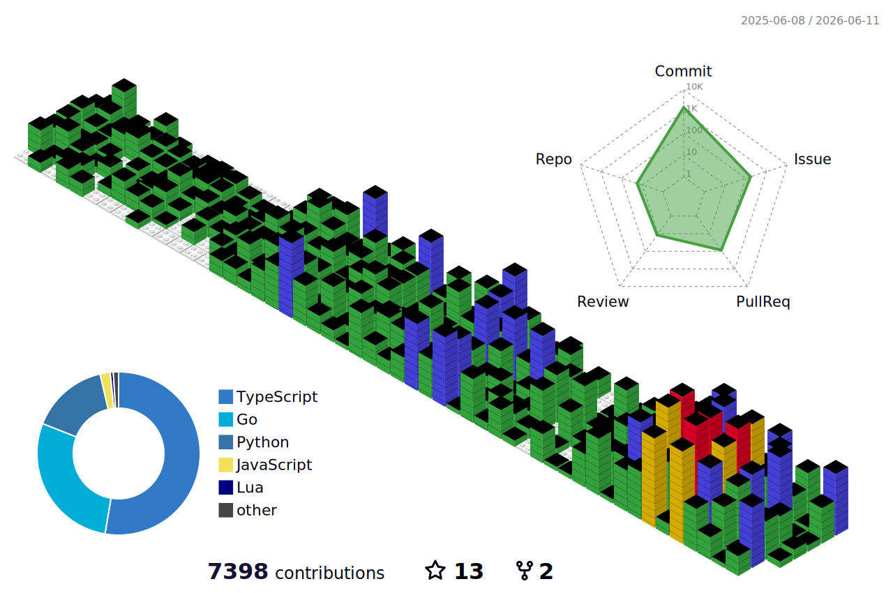

Call me **Chuan**.

_Full Stack Engineer / Concert Lighting Designer_

---

### Get in Touch

[Blog](https://www.chienchuanw.com/en/) / [LinkedIn](https://www.linkedin.com/in/chienchuanw/) / [Instagram](https://www.instagram.com/chienchuanw/) / [Facebook](https://www.facebook.com/chienchuan.wang/) / [Email](mailto:chienchuanwww@gmail.com)

Discord: chienchuanw
